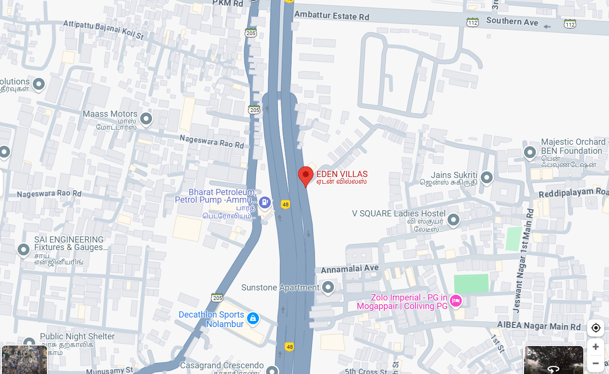

# Ex04 Places Around Me
## Date: 02/05/2025

## AIM
To develop a website to display details about the places around my house.

## DESIGN STEPS

### STEP 1
Create a Django admin interface.

### STEP 2
Download your city map from Google.

### STEP 3
Using ```<map>``` tag name the map.

### STEP 4
Create clickable regions in the image using ```<area>``` tag.

### STEP 5
Write HTML programs for all the regions identified.

### STEP 6
Execute the programs and publish them.

## CODE
### image.html
```
<html>
<head>image map</head>
<title>
image map
</title>
<body>
 <!-- Image Map Generated by http://www.image-map.net/ -->


<map name="image-map">
    <area target="" alt="Decathlon sports" title="Decathlon sports" href="decathlon.html" coords="471,682,105" shape="circle">
    <area target="" alt="V SQUARE ladies hostel" title="V SQUARE ladies hostel" href="V square.html" coords="950,462,691,609" shape="rect">
    <area target="" alt="Bharat petroleum" title="Bharat petroleum" href="petrol bunk.html" coords="53,528,302,252,554,432" shape="poly">
</map>
</body>
</html>
```
### decathlon.html
```
<html>
    <head>decathlon</head><body ng="cyan">
        <dl>
        <dt align="centre">decathlon</dt>
        <dd>
            Decathlon is a French sporting goods retailer, the world's largest in its field, known for its wide range of sports equipment and apparel, designed, tested, and manufactured in-house, with a focus on affordability and accessibility for a variety of sports. 

            
        </dd>
        </dl>
    </body>
</html>
```
### petrol bunk.html

```
<html>
    <head>petrol bunk</head><body ng="cyan">
        <dl>
        <dt align="centre">petrol bunk</dt>
        <dd>
            Bharat Petroleum Corporation Limited (BPCL) is a major Indian public sector oil and gas company headquartered in Mumbai. It is known for its refining, distribution, and marketing of petroleum products, including fuels like petrol, diesel, LPG, and CNG. BPCL has a significant presence in both the upstream and downstream sectors of the oil and gas industry, operating refineries and a network of fuel stations across India. 
        </dl>
    </body>
</html>
```
### V square.html
```
<html>
    <head>V square</head><body ng="cyan">
        <dl>
        <dt align="centre">V square</dt>
        <dd>
            V Square Ladies Hostel in Mogappair West, Chennai, is a hostel specifically for women, offering amenities like air-conditioned rooms and wheelchair accessibility. It is known for its clean, well-maintained rooms and good management, along with helpful staff.
        </dd>
        </dl>
    </body>
</html>
```

## OUTPUT
### image

### decathlon

### petrol bunk

### V square


## RESULT
The program for implementing image maps using HTML is executed successfully.
